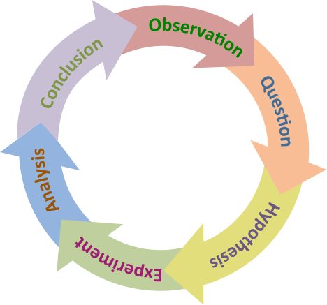
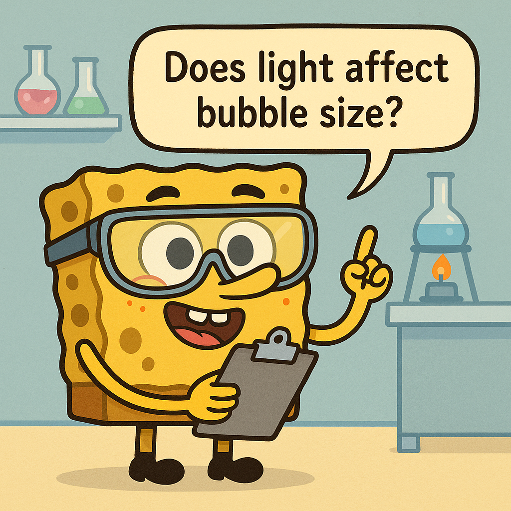
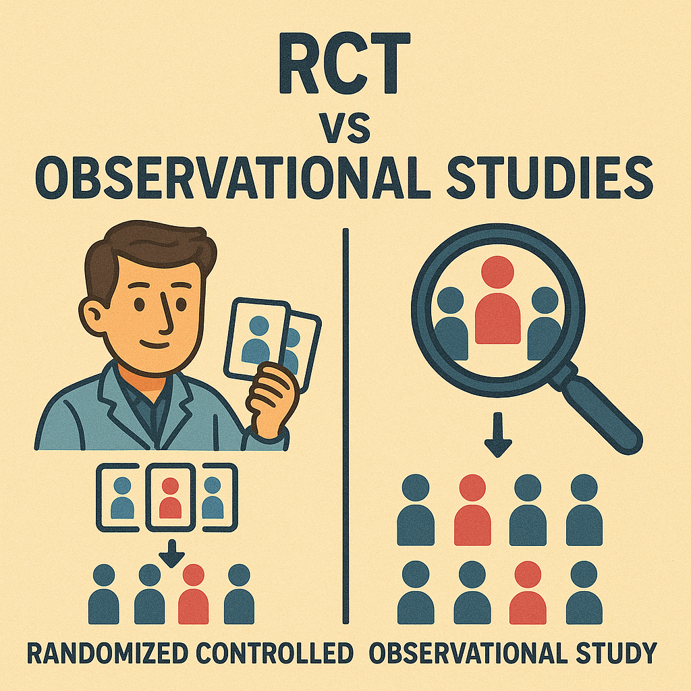
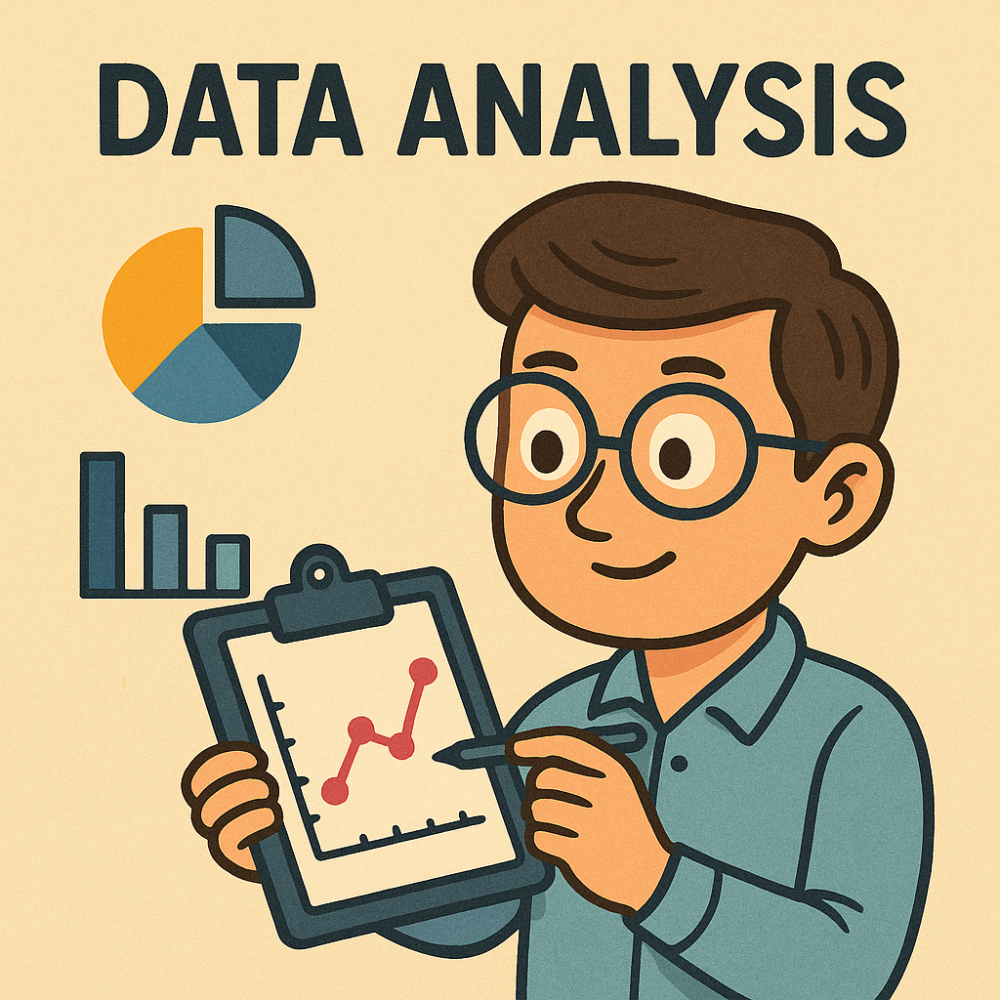
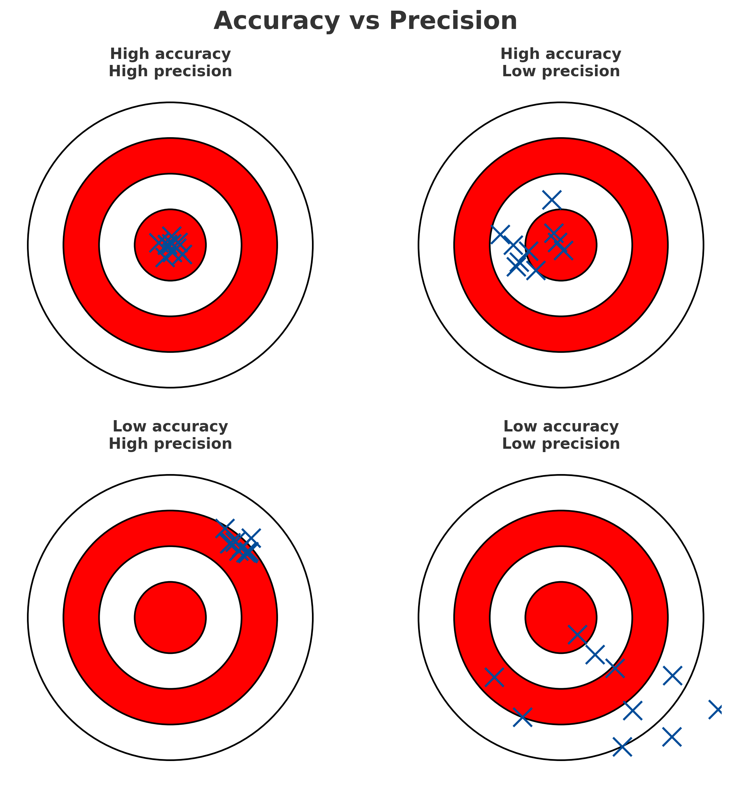

## Introduction

::: {.columns}
::: {.column width="55%"}
Research is a careful way of asking and answering questions about the world. The scientific method gives us a simple loop:  
- observe → ask → guess (hypothesis) → test with data → analyse → conclude → share. 

If a guess isn’t supported, we refine it and try again. These notes explain each step with everyday and scientific examples, then show how data analysis, communication, and reporting principles make research trustworthy and useful.
:::

::: {.column width="45%"}
```text
You will learn to
- Form a focused, testable question
- Write a clear hypothesis
- Design a fair test (control vs experiment)
- Analyse data (describe, test, conclude)
- Communicate clearly (write, talk, visualise)
- Report with transparency, reproducibility, and ethics
```
:::
:::

---

## The scientific method at a glance


1) Observation → Question
2) Background research
3) Hypothesis (testable prediction)
4) Experiment or observation (collect data)
5) Analysis → Conclusion (support/not support)
6) Communicate → Others can check and build on it




This is a cycle. “Not supported conclusions” show progress: it tells us to improve the question, method, or hypothesis and try again.


::: {.callout-tip}
Keep a simple research log (date, question, guess, key settings, result). It makes write‑up and troubleshooting much faster.
:::

---

## Observation and question

::: {.columns}
::: {.column width="55%"}
Good questions come from noticing something and asking “why/how?”. Make the question specific and testable.  

Everyday examples  
- Warm classroom → “Why is this classroom so warm?”  
- Toaster won’t work → “What’s wrong with this toaster?”

Scientific example  
- Algae in a lake increased → “Does fertiliser runoff increase algae growth?”
:::

::: {.column width="45%"}
```text
Checklist
- Specific (who/what/where/when)
- Testable with data
- Grounded in what is known (do a quick read)
```

:::
:::

::: {.callout-tip}
If the question feels vague, shrink the scope (time window, location, subset) until you can imagine measuring an answer.
:::

---

## Background research

::: {.columns}
::: {.column width="55%"}
Read just enough to make a smart, testable guess. Look up key terms, past findings, methods, and common pitfalls. This prevents re‑inventing the wheel and keeps your guess realistic.
:::

::: {.column width="45%"}
```text
Sources to scan
- Intro texts / review articles
- Reputable websites / handbooks
- Prior datasets, lab notes, or manuals
```
:::
:::

::: {.callout-note}
Capture 3–5 keywords and 2 likely pitfalls you see repeatedly. These will shape your hypothesis and controls.
:::

---

## Hypothesis (a testable prediction)

A supposition or proposed explanation made on the basis of limited evidence as a starting point for further investigation

A hypothesis links a cause (independent variable) to an effect (dependent variable). Write it as a clear “If … then …” prediction you can check with data.

In science, words matter. They are not casual clothing we can swap for comfort; they are uniforms that carry rank, history, and weight. Yet some words, stripped of their rigor, wander into everyday speech like escaped lab mice. Theory is one of the most abused.

When a physicist says, I have a theory, it is shorthand for something extraordinary: a framework built from observation, tested against data, and sharpened by attempts to prove it wrong. A theory in science is not a guess; it is a cathedral of evidence. Gravity is a theory. Evolution is a theory. Both have survived every experiment designed to topple them.

But in the supermarket, on talk shows, and across social media, theory has been demoted to mean idea or hunch. Someone who says, “I have a theory that cats can sense bad vibes” is not presenting a theory. They are offering an untested speculation. The word has been stretched until it snaps.

The same fate befalls significant. In statistics, significance is a cold, precise measure of probability. A result is significant because it is unlikely to be due to chance, given the chosen threshold. Outside science, however, significant is used to mean important. A “statistically significant but clinically trivial” effect becomes, in the public ear, a discovery of great consequence.

Then there is hypothesis. For researchers, it is a carefully framed question: does factor A influence outcome B under condition C? For others, it is just another synonym for guesswork.

And so the abuse continues. Words that once held scientific precision are diluted, spread thin, repurposed. This is not merely a semantic quibble. When the public hears “theory” as “guess,” they may dismiss climate science as if it were astrology. When they hear “significant” as “important,” they may overestimate minor results.

Science depends on clarity. Each word is a tool, and when blunted by misuse, it can no longer cut through confusion.

So next time someone says, I have a theory, it is worth asking: do you mean a cathedral of evidence, or just a hunch scribbled on a napkin?

Hypothesis Examples  
- Classroom: If the air conditioner is off (cause), then the room will be warm (effect).  
- Toaster: If the outlet has no power, then other devices won’t work in that outlet.  
- Plants: If plants receive fertiliser, then average height increases.

::: {.callout-tip}
Write two rival hypotheses that explain the same effect. Design your test so at least one would be contradicted by the data.
:::

---

## Experimentation (testing fairly)

::: {.columns}
::: {.column width="55%"}
A fair test changes the cause and observes the effect while keeping other factors steady. Use a control (baseline) and an experimental condition (with the change). Repeat enough times to reduce chance effects.  

Types of studies  

- Controlled experiment: you manipulate the cause (e.g., add fertiliser to some tanks, not others).  
- Observational study: you measure what already varies (e.g., algae in lakes near vs far from farms). This is great when manipulation is impractical or unethical.
:::

::: {.column width="45%"}
```text
Design tips
- Define variables and units upfront
- Use a control and replicate
- Keep records (dates, settings, instruments)
```

:::
:::

::: {.callout-caution}
Confounders creep in silently (e.g., light, temperature, prior treatment). List the top 3 and how you’ll control or measure them.  
:::

Everyday test (toaster)
- Plug a coffee maker into the same outlet → Works?  
If no: outlet likely faulty (supports hypothesis).  
If yes: hypothesis not supported; try a new hypothesis (toaster’s fuse/heating element).

---

## Analysis and conclusions

::: {.columns}
::: {.column width="55%"}
Organise, visualise, and summarise your data. For numbers, compute averages and spreads; for categories, count themes. Use statistical tests when comparing groups or testing relationships.

Interpret carefully  
- Data support or do not support the hypothesis; they don’t “prove” it.  
- Don’t confuse correlation with causation.  
- Discuss both statistical and practical importance.  
- Be transparent about uncertainty and limits.  
:::

::: {.column width="45%"}
```text
Quick workflow
1) Clean and plot (tables/graphs)
2) Describe (mean/median, SD/range)
3) Test (t‑test/chi‑square/ANOVA/regression)
4) Conclude (supported? next steps?)
```


:::
:::

::: {.callout-note}
A tiny p‑value can hide a tiny effect. Always pair significance with an effect size and, when possible, a confidence interval.  
:::


### Data types

::: {.columns}
::: {.column width="55%"}

- Quantitative (numbers): counts or measurements  
  - Discrete: counts (e.g., colonies, cars per home)  
  - Continuous: measurements (e.g., height, temperature)  
- Qualitative (descriptions): notes, transcripts, categories 

:::
 

::: {.column width="45%"}
```text
Match method to type
- Counts → bar charts, chi‑square
- Measurements → histograms, t‑tests, ANOVA
- Text → coding themes, frequency tallies
```
:::
:::

::: {.callout-tip}
Pick the plot that answers your question in one glance. If readers must “decode”, redesign the figure.  
:::

### Collecting data

Experiments, observations, surveys, instruments/sensors, and existing datasets. Plan for quality: sampling, calibration, piloting questions, clear protocols. 

Aim for high accuracy (closeness to truth) and precision (reproducibility of result/observation). There is often a trade-off between the two.




### Processing and cleaning (before analysis)

Standardise entries, handle missing values, detect outliers, compute needed variables, and document every step. “Garbage in, garbage out.”

### Statistical techniques (two families)

- Descriptive: means/medians, spread, tables/graphs → show what the data look like.
- Inferential: hypothesis tests and intervals → decide if patterns likely reflect real effects rather than chance.

## Communicate (so others can check and use it)

::: {.columns}
::: {.column width="55%"}
Share your methods, data (when ethical), and results clearly. Communication closes the loop and turns personal discovery into shared knowledge others can evaluate and build on.  
:::

::: {.column width="45%"}
```text
Formats
- Lab/report (IMRaD structure)
- Talk/poster (story + key visuals)
- Datasets/code (with docs)
```
:::
:::

::: {.callout-tip}
Use an IMRaD “skeleton slide” (one-liners for Intro, Methods, Results, Discussion) to plan both papers and talks before you draft.  
:::


### Writing (IMRaD = a paper that mirrors the method)

- Introduction: question, background, hypothesis
- Methods: what you did (enough detail to repeat it)
- Results: what you found (figures/tables)
- Discussion: what it means, limits, how it fits the field

[Article: Understanding IMRaD](https://pmc.ncbi.nlm.nih.gov/articles/PMC4473858/)

### Oral talks

Think about a time when you ran a small experiment in your personal life. This could be anything—from testing a new study routine, trying a fitness app, comparing two cooking methods, or seeing if a change in your schedule improved your productivity.

Prepare a short slide deck (3–5 slides) to tell the story of your experiment.

Your slides should cover:

- Why it matters

- What motivated you?

- Why was this experiment important or interesting to you?

- What you did

- Briefly describe your setup: what did you change or test, and how?

- One or two key results

- Share the main finding(s). Use simple, readable visuals (chart, photo, diagram) to make it clear.

- What did you learn?

- Would you change anything, keep doing it, or test something new

---

## Principles of scientific reporting

### Transparency and openness 

- Explain methods 
- Show data (when ethical) 
- Share code/settings 
- Report unexpected/negative results. 

Make it possible for others to understand and check your work.

### Reproducibility and replicability 

- Reproducible: same data + same analysis → same results. 

- Replicable: new data + same question → consistent results. 

Provide data/code or detailed methods so others can verify.

### Proper citation and acknowledgment

- Give credit for ideas, data, and methods. 
- Cite consistently so readers can find sources. 
- Avoid plagiarism; add acknowledgments and funding/conflict disclosures.

### Ethics and integrity

- Report honestly; do not fabricate/falsify. 
- Follow human/animal ethics approvals. 
- Disclose conflicts. 
- Correct the record when needed. Science is built on trust.

---

## Conclusion

The scientific method is a simple loop that builds reliable knowledge: ask, guess, test, analyse, and share. Data analysis turns raw observations into evidence; communication turns evidence into shared understanding; and good reporting principles maintain trust. Practice the cycle, be curious and cautious, and write so others can repeat your path. That’s how research moves from personal insight to progress for everyone. 

## Workshop: Reverse‑engineering a research plan (2 hours)

By the end, you will be able to:
- find a paper’s research question, variables, and study design
- outline the authors’ analysis plan in plain words
- read a figure and say what the error bars represent
- spot one possible weakness and suggest an improvement

### What you need
- One peer‑reviewed research paper (any science) with:
  - a clear Methods section
  - at least one inferential result (e.g., t, χ², F, or a regression)
  - one figure with error bars
- If choosing is hard, use a paper from the shortlist provided in class.

### Plan 

#### Warm‑up  
- Goal: “Read like a scientist by reverse‑engineering the plan the authors likely had.”  
- Skim your paper from title to the first results figure.

#### Paper snapshot and PICO

Start by capturing the “who/what, what changed, compared to what, and what was measured.” This is called PICO. Use the paper’s own words when you can.

Paper snapshot (2–3 lines)  
- Citation; field; study type: experimental or observational (not a review)  
- One line that says what the study tried to find out  

What PICO means  
- P — Population/Problem: who or what was studied, and in what context  
- I/E — Intervention/Exposure (or key predictor): what was changed, tested, or focused on  
- C — Comparison/Control: what it was compared to (baseline group or condition)  
- O — Outcome(s): what was measured; if several, note which seems primary  

Where to find it fast  
- Title and abstract: the question and main comparison  
- Methods/Participants: the P (who/what) and sometimes the C (control)  
- Procedure/Measures: details for I/E and O  
- Results and figure captions: wording for outcomes and groups  

::: {.columns}
::: {.column width="52%"}
Tips
- Copy/Quote short phrases from the paper for key terms in your PICO; paraphrase only if needed.
- If a PICO item isn’t stated, write “not stated”, don’t guess.
- Keep your question and hypothesis simple:
  - Question: “Does X compared with Y change outcome O?”
  - Hypothesis: “X will lead to higher/lower/different O than Y.”
:::

::: {.column width="48%"}
```text
Worked example
Title: Caffeine improves reaction time in adults
Study type: Experimental

P: Healthy adults
I/E: 200 mg caffeine capsule
C: Decaf placebo capsule
O: Mean reaction time on computerized test (ms)

Research question:
Does 200 mg caffeine reduce reaction time compared with placebo?

Simple hypothesis:
Adults given caffeine will have faster (lower) reaction times than placebo.
```
:::
:::

#### Reverse‑engineer the plan  
Build a plain‑language plan from what’s reported:  
- Variables: name the main variables and how they were measured (units or scales)  
- Design: how were units selected/assigned? any groups? timing? about how many participants/samples?  
- Primary analysis: what comparison or model answers the main question? (name the test if stated; if not, say “compare group A vs B” or “relate X to Y”)  
- Figure plan: one figure that would answer the main question. State:  
  - type (bar/line/scatter/box/other)  
  - axes (x and y)  
  - summary (mean/median/other)  
  - error bars (SD/SE/95% CI) — write what the paper says; if unclear, write “not stated”  
- Outcome rule: complete the sentence “We would conclude … if …”.  

#### Methods check: figure and uncertainty  
- Read the main figure carefully:  
  - What do the axes and units show?  
  - How many observations (n) per group/condition?  
  - What do the bars/points summarize (mean or median)?  
  - What do the error bars represent (SD, SE, or 95% CI)? If not stated, note that.  
- Name one possible weakness (e.g., small sample, missing comparison, unclear measure) and one thing done well.  

#### Openness check (simple)  
Make a brief checklist from the paper and its links:  
- Data shared? where?  
- Code or analysis shared? which tool?  
- Materials shared (e.g., survey, stimuli, protocol)?  
- Any preregistration or protocol mentioned?  
Write one sentence on how openness could be improved.  

#### 90‑second micro‑presentation  
Present to a nearby group:  
- paper snapshot (question + design)  
- reconstructed plan (primary analysis + your figure plan + outcome rule)  
- one takeaway about uncertainty (what the error bars mean) + one limitation  
- one concrete improvement you would make  

#### Class debrief  
- What was easy to reconstruct? What was usually missing?  
- Quick show of hands: who found a paper that clearly stated what its error bars mean?  
- Exit ticket: “If I preregistered this study from scratch, I would change … because …”.  

### One‑page handout

#### Paper Snapshot (PICO)
```text
Paper Snapshot (PICO)
Citation:
Field:
Study type:  Experimental  /  Observational

P: Who/what was studied?
I/E: What was changed/tested or the key predictor?
C: What was it compared to?
O: What outcomes were measured?

Research question (one sentence):
Simple hypothesis:
```

#### Reverse‑Engineered Plan (plain language)
```text
Reverse‑Engineered Plan
Variables
Main variables: ______________________________________________
How measured (units/scales): __________________________________

Design
Selection/assignment: _________________________________________
Groups/conditions: ____________________________________________
Timing: _________________________   Approx. N: ________________

Primary analysis (plain words)
Test named in paper (if any): _________________________________
If no test named: compare/relate ______________________________

Figure plan
Type: bar / line / scatter / box / other: __________
Axes (x/y): _______________________________________
Summary: mean / median / other _____________________
Error bars: SD / SE / 95% CI / not stated

Outcome rule
“We would conclude … if …” _________________________
```

#### Openness Checklist (brief)
```text
Openness Checklist
Data shared?     Yes / No    Where: __________________________
Code shared?     Yes / No    Tool: ___________________________
Materials shared? Yes / No   What: ___________________________
Prereg/protocol? Yes / No    Link or note: ___________________

One improvement to openness: _________________________________
``` 
